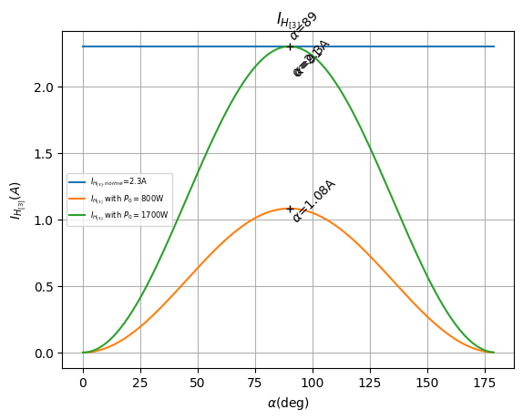
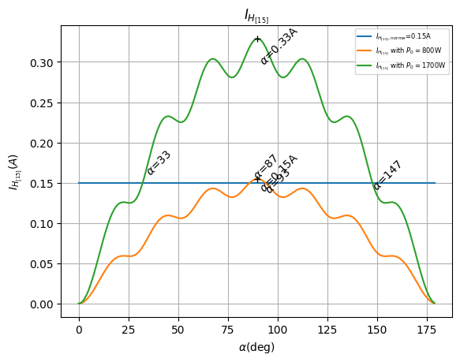

# AC Dimming

When controlling AC power devices like TRIACs, SSRs, and voltage regulators, there are several dimming approaches available. Each method has specific characteristics, advantages, and limitations that affect precision, grid compatibility, and regulatory compliance.

## Method Comparison

### Phase Control

**How it works:** Controls power by delaying the firing angle within each AC semi-period (twice per cycle). The TRIAC/SSR activates at a specific point in the sine wave, "chopping" the waveform to deliver partial power.

**Advantages:**

- ✅ **High Precision**: Can adjust power at each semi-period (every 10ms for 50Hz), enabling watt-level control
- ✅ **Fast Response**: Instant power adjustment with no delay
- ✅ **Accurate Power Control**: With Power LUT, achieves predictable power output matching the desired level
- ✅ **Regulatory Compliant**: Keeps grid balanced (no DC component) when properly implemented
- ✅ **Widely Used**: Standard method in commercial dimmers and variable speed drives

**Limitations:**

- ⚠️ **Harmonics**: Generates harmonic distortion, especially at 50% power (90° phase angle)
  - Harmonics are regulated by CEI 61000-3-2 (Class A devices)
  - H3 (3rd harmonic) is the most significant, exceeds limits at 50% dimming with ~1700W nominal load
  - H15 (15th harmonic) first to exceed limits at ~760W nominal load
  - Maximum compliant load: ~800W without mitigation
- ⚠️ **Mitigation may be required**: May need RC snubbers, proper wiring, load management, or limiter settings

**MycilaDimmer implementations using phase control:**

- `ThyristorDimmer` — Direct TRIAC/Random SSR control with zero-cross detection
- `PWMDimmer` — Generates PWM signal for a PWM-to-analog converter to drive voltage regulators (LSA, LCTC)
- `DFRobotDimmer` — Outputs 0-10V analog via I2C DAC to voltage regulators (LSA, LCTC)

All three support the **Power LUT** for linearized power delivery and expose `calculateHarmonics()` for harmonic analysis.

---

### Cycle Stealing (Delta-Sigma)

**How it works:** Instead of chopping the sine wave, Cycle Stealing delivers complete half-cycles of power to the load.
This library uses an advanced **First-Order Delta-Sigma Modulator (Bresenham's algorithm)** to optimally distribute ON/OFF cycles.
Crucially, it enforces **DC Balance**, ensuring that for every positive half-cycle consumed, a negative one is also consumed, preventing DC offset on the grid.

**Advantages:**

- ✅ **Zero Noise**: Switches exactly at zero-crossing, generating virtually no EMF / RFI noise
- ✅ **Grid Friendly**: Strictly maintains DC balance, avoiding transformer saturation and grid asymmetry issues
- ✅ **High Compatible**: Works with standard Zero-Cross SSRs (cheaper) as well as Random SSRs/TRIACs
- ✅ **Fast Response**: The accumulator-based algorithm responds to duty cycle changes instantly

**Limitations:**

- ❌ **Flickering**: Not suitable for lighting. The rapid on/off pulsing causes visible flicker in bulbs
- ❌ **Sub-Harmonics**: Generates inter-harmonics and sub-harmonics (frequencies below 50/60Hz)
- ❌ **No Power LUT**: Does not support the Phase Control Power LUT feature
- ❌ **Thermal Inertia Required**: Only suitable for purely resistive loads with high thermal inertia (water heaters, oil radiators, floor heating)

!!! info
See the [Cycle Stealing Algorithm](cycle_stealing.md) page for a detailed technical explanation.

## Harmonic Analysis (Class A Compliance)

According to the **CEI 61000-3-2** standard, Class A equipment includes:

- Balanced three-phase equipment
- Household appliances excluding equipment identified as Class D
- Tools excluding portable tools
- Dimmers for incandescent lamps
- Audio equipment

The standard defines maximum permissible harmonic currents for each harmonic order (up to the 40th harmonic).

### Harmonic Current Measurements

The following graphs show the harmonic currents (H3 and H15) generated by a phase-controlled load compared to the Class A limits.

**H3 (3rd Harmonic - 150Hz/180Hz):**

The 3rd harmonic is typically the most significant. As shown below, it exceeds the Class A limit of 2.30A at approximately **1700W** load with phase control.

**H15 (15th Harmonic - 750Hz/900Hz):**

While lower in magnitude, higher-order harmonics also have strict limits. The 15th harmonic exceeds its Class A limit (0.15 \* 15/n) at approximately **800W** load.

!!! warning "Compliance Notice"
For loads exceeding ~800W, standard phase control dimming is likely non-compliant with CEI 61000-3-2 Class A limits without additional harmonic mitigation (filters) or alternative control strategies.

---

## Choosing the Right Method

| Use Case                      | Recommended Method                                           |
| :---------------------------- | :----------------------------------------------------------- |
| Solar router / high precision | **Phase Control** (ThyristorDimmer) with harmonic mitigation |
| Water heater / resistive load | **Cycle Stealing** (CycleStealingDimmer)                     |
| Voltage regulator (0-10V)     | **DFRobot DAC** (DFRobotDimmer)                              |
| Voltage regulator (PWM)       | **PWM** (PWMDimmer)                                          |
| Simple on/off                 | Standard Zero-Cross SSR with relay                           |

---

## Harmonic Mitigation for Phase Control

When using phase control, harmonics can be reduced or partially mitigated through several approaches:

1. **Power Limiter**: Limit the dimmer to 40% of nominal load
2. **Reduced Load**: Use lower wattage resistance (e.g., 1000W @ 53Ω instead of 3000W @ 18Ω)
3. **Proper Wiring**: Minimize cable length, use appropriate wire gauge
4. **Strategic Placement**: Position router close to grid entry/exit point
5. **Stepped Loads**: Use multiple resistances with relays (e.g., 3× 800W elements)
6. **RC Snubbers**: 100Ω 100nF snubbers can help with sensitive equipment

---

## References

- [CEI 61000-3-2 Harmonic Standards](http://crochet.david.online.fr/bep/copie%20serveur/Normes/cei%2061000-3-2.pdf)
- [Etude des harmoniques du courant de ligne](https://www.thierry-lequeu.fr/data/TRIAC.pdf) (Thierry Lequeu)
- [Détection et atténuation des harmoniques](https://fr.electrical-installation.org/frwiki/Détection_et_atténuation_des_harmoniques) (Schneider Electric)
- [HARMONICS: CAUSES, EFFECTS AND MINIMIZATION](https://www.salicru.com/files/pagina/72/278/jn004a01_whitepaper-armonics_%281%29.pdf) (Ramon Pinyol)
- [Cycle Stealing Control](https://www.renesas.com/en/document/apn/1164-cycle-stealing-control) (Vladimir Veljkovic, Renesas)
- [Optimized Random Integral Wave AC Control Algorithm for AC heaters](https://tsltd.github.io)
- [Learn: PV Diversion](https://docs.openenergymonitor.org/pv-diversion/)
- [YaSolR Overview - Detailed Analysis](https://yasolr.carbou.me/overview)
