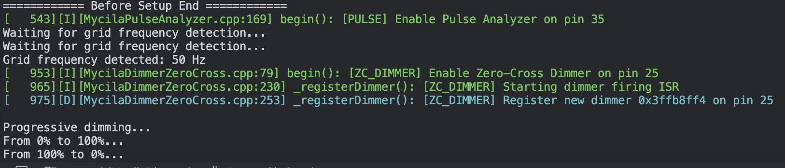

# MycilaDimmer

[](https://opensource.org/licenses/MIT)
[](https://github.com/mathieucarbou/MycilaDimmer/actions/workflows/ci.yml)
[](https://registry.platformio.org/libraries/mathieucarbou/MycilaDimmer)

A comprehensive ESP32/Arduino library for controlling AC power devices including TRIACs, SSRs, and voltage regulators through multiple dimming methods.




## Overview

MycilaDimmer provides a unified interface for controlling AC power devices through different hardware implementations. The library uses a polymorphic architecture that allows you to switch between different dimming methods without changing your application code.

**Key Benefits:**

- **Unified API** — Same interface for all dimmer types
- **IRAM Safe** — Interrupt handlers work during flash operations
- **Hardware Agnostic** — Supports multiple hardware approaches
- **Production Ready** — Used in [YaSolR](https://yasolr.carbou.me) Solar Router

## Features

- ✨ **Flicker-Free Dimming**: Progressive dimming without flickering using precise DAC control or zero-cross detection with quality ZCD circuits
- 🎛️ **Multiple Control Methods**: Zero-cross detection, PWM, and I2C DAC
- ⚡ **High Performance**: IRAM-safe interrupt handlers with lookup table optimization
- 💡 **Selectable Dimming Curves**: Choose between linear dimming or Power LUT for perceptual brightness matching — switch at runtime
- 🔧 **Flexible Configuration**: Duty cycle remapping, calibration, and user-selectable dimming modes
- 📊 **Rich Telemetry**: Duty cycle measurements, firing ratios, and online status
- 🛡️ **Safety Features**: Duty cycle limits and grid connection detection
- 📱 **JSON Integration**: Optional ArduinoJson support for telemetry
- 🔄 **Real-time Control**: Microsecond-precision timing control

## Supported Hardware

- **ESP32** (all variants: ESP32, ESP32-S2, ESP32-S3, ESP32-C3, ESP32-C6, ESP32-H2) via Arduino Framework
- **TRIACs** with zero-cross detection circuits
- **Random Solid State Relays (SSRs)**
- **Voltage Regulators** with 0-10V control (LSA, LCTC, etc.)
- **DFRobot DAC Modules** (GP8211S, GP8413, GP8403)

## Quick Start

```cpp
#include <MycilaDimmers.h>

Mycila::PWMDimmer dimmer;

void setup() {
  Serial.begin(115200);
  dimmer.setPin(GPIO_NUM_26);
  dimmer.begin();
  dimmer.setDutyCycle(0.5); // 50% power
}

void loop() {
  for (float power = 0.0; power <= 1.0; power += 0.1) {
    dimmer.setDutyCycle(power);
    delay(1000);
  }
}
```

## License

This project is licensed under the MIT License - see the [LICENSE](LICENSE) file for details.

## Disclaimer

_This website is provided for informational purposes only. By accessing this site and using the information contained herein, you accept the terms set forth in this disclaimer._

- _**Accuracy of Information**: We strive to provide accurate and up-to-date information on this site, but we cannot guarantee the completeness or accuracy of this information. The information provided is subject to change without notice._

- _**Use of Information**: Use of the information provided on this site is at your own risk. We decline all responsibility for the consequences arising from the use of this information. It is recommended that you consult a competent professional for advice specific to your situation._

- _**External Links**: This site may contain links to external websites which are provided for your reference and convenience. We have no control over the content of - _**External Links**: Thie accept no res- _**External Links**: This site may contain links to external websites which are provided ft extent permitted by applicable law, we disclaim all liability for any direct, indirect, incidental, consequential or special damages arising out of the use of, or inability to use, this website, - _**External Links**: This site may contain links to external websites which are provided for your reference and convenience. We have no control over the content of - _**External Links**: Thie accept no res- _**External Links**: This sitgree to these terms, please do not use this site.\*\*\_

---

**Author**: [Mathieu Carbou](https://github.com/mathieucarbou)  
**Used in**: [YaSolR Solar Router](https://yasolr.carbou.me)
